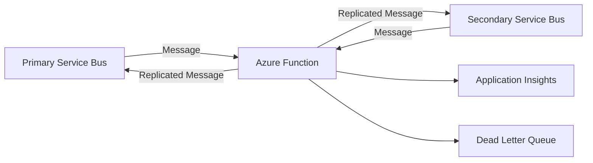

# Azure Service Bus Message Replication Function

[](https://github.com/dteenergy/cloud-application-servicebus-replication/actions/workflows/ci.yml)
[](https://www.python.org/downloads/)
[](https://github.com/astral-sh/ruff)

> **Production Ready**: Enterprise-grade Azure Function for high-availability message replication across Service Bus namespaces.

## Overview

This Azure Function provides robust, bidirectional message replication between Azure Service Bus namespaces, enabling:

- **Disaster Recovery**: Automatic failover capabilities for business continuity
- **High Availability**: Cross-region message synchronization
- **Compliance**: Structured logging and monitoring for enterprise requirements
- **Scalability**: Event-driven architecture that scales automatically

## Architecture



## Features

### 🔄 **Bidirectional Replication**
- Primary-to-Secondary and Secondary-to-Primary message flow
- Configurable replication direction
- Message deduplication and correlation tracking

### ⚡ **High Performance**
- Event-driven processing with Azure Service Bus triggers
- Exponential backoff retry logic with configurable attempts
- Dead letter queue handling for failed messages

### 🔒 **Enterprise Security**
- Azure Managed Identity integration
- Secure connection string management
- Comprehensive audit logging

### �️ **Reliability**
- TTL (Time To Live) configuration based on RTO/RPO requirements
- Message correlation tracking across replication boundaries
- Structured error handling with appropriate alerting

### 📊 **Observability**
- Azure Application Insights integration
- Structured logging with correlation IDs
- Configurable alert severity levels
- Performance metrics and monitoring

## Quick Start

### Prerequisites

- **Azure Subscription** with Service Bus namespaces
- **Python 3.11+**
- **Azure Functions Core Tools** v4
- **Azure CLI** (for deployment)

### Local Development

1. **Clone the repository**
   ```bash
   git clone https://github.com/dteenergy/cloud-application-servicebus-replication.git
   cd cloud-application-servicebus-replication
   ```

2. **Set up Python environment**
   ```bash
   python -m venv .venv
   source .venv/bin/activate  # On Windows: .venv\Scripts\activate
   pip install -r requirements.txt
   ```

3. **Configure local settings**
   ```bash
   cp local.settings.json.example local.settings.json
   # Edit local.settings.json with your Service Bus connection strings
   ```

4. **Run locally**
   ```bash
   func start
   ```

## Configuration

### Environment Variables

| Variable | Description | Required | Default |
|----------|-------------|----------|---------|
| `REPLICATION_TYPE` | Direction: `primary_to_secondary` or `secondary_to_primary` | ✅ | - |
| `PRIMARY_SERVICEBUS_CONN` | Primary Service Bus connection string | ✅ | - |
| `PRIMARY_QUEUE_NAME` | Primary queue name | ✅ | - |
| `SECONDARY_SERVICEBUS_CONN` | Secondary Service Bus connection string | ✅ | - |
| `SECONDARY_QUEUE_NAME` | Secondary queue name | ✅ | - |
| `RTO_MINUTES` | Recovery Time Objective in minutes | ❌ | 10 |
| `DELTA_MINUTES` | Additional buffer time in minutes | ❌ | 2 |
| `DLQ_ENABLED` | Enable dead letter queue handling | ❌ | true |
| `MAX_RETRY_ATTEMPTS` | Maximum retry attempts for failed operations | ❌ | 3 |
| `BASE_RETRY_DELAY` | Base delay in seconds for exponential backoff | ❌ | 1.0 |

### Example Configuration

```json
{
  "IsEncrypted": false,
  "Values": {
    "AzureWebJobsStorage": "UseDevelopmentStorage=true",
    "FUNCTIONS_WORKER_RUNTIME": "python",
    "REPLICATION_TYPE": "primary_to_secondary",
    "PRIMARY_SERVICEBUS_CONN": "Endpoint=sb://primary.servicebus.windows.net/;SharedAccessKeyName=...",
    "PRIMARY_QUEUE_NAME": "orders",
    "SECONDARY_SERVICEBUS_CONN": "Endpoint=sb://secondary.servicebus.windows.net/;SharedAccessKeyName=...",
    "SECONDARY_QUEUE_NAME": "orders-replica",
    "RTO_MINUTES": "15",
    "DELTA_MINUTES": "5"
  }
}
```

```

## Project Structure

```
cloud-application-servicebus-replication/
├── src/                          # Production code
│   ├── __init__.py              # Package marker
│   ├── main.py                  # Azure Function entry point
│   ├── config.py                # Pydantic configuration models
│   ├── constants.py             # Application constants
│   ├── error_handlers.py        # Centralized error handling
│   ├── exceptions.py            # Custom exception classes
│   ├── logging_utils.py         # Structured logging utilities
│   ├── message_utils.py         # Message processing utilities
│   └── retry_utils.py           # Exponential backoff retry logic
├── tests/                       # Test suite
│   ├── __init__.py             # Test package marker
│   ├── test_main.py            # Comprehensive unit tests
│   └── README.md               # Testing documentation
├── .github/                     # GitHub workflows
│   └── workflows/
│       ├── ci.yml              # Continuous integration
│       ├── on-pull-request.yaml
│       └── on-push.yaml
├── pyproject.toml              # Project configuration & dependencies
├── requirements.txt            # Python dependencies
├── host.json                   # Azure Functions configuration
├── local.settings.json         # Local development settings
├── .pre-commit-config.yaml     # Code quality hooks
└── README.md                   # This file
```

## Development

### Code Quality Standards

This project maintains high code quality through:

- **[Ruff](https://github.com/astral-sh/ruff)**: Lightning-fast Python linter and formatter
- **[MyPy](https://mypy-lang.org/)**: Static type checking
- **[Pre-commit hooks](https://pre-commit.com/)**: Automated code quality checks
- **Comprehensive test coverage** with pytest

### Setting Up Development Environment

1. **Install development dependencies**
   ```bash
   pip install -r requirements.txt
   pip install pytest pytest-cov pytest-mock
   ```

2. **Set up pre-commit hooks**
   ```bash
   pre-commit install
   pre-commit run --all-files
   ```

3. **Run code quality checks**
   ```bash
   # Linting and formatting
   ruff check src/ tests/
   ruff format src/ tests/
   
   # Type checking
   mypy src/
   ```

### Testing

#### Running Tests

```bash
# Run all tests
pytest

# Run with coverage report
pytest --cov=src --cov-report=html

# Run specific test class
pytest tests/test_main.py::TestConfigurationLoading

# Run tests with verbose output
pytest -v tests/
```

#### Test Structure

The test suite includes:

- **Unit Tests**: Individual function and class testing
- **Integration Tests**: Component interaction testing  
- **Configuration Tests**: Pydantic model validation
- **Error Handling Tests**: Exception and error flow testing

#### Test Coverage

Maintain >90% test coverage for production code:

```bash
pytest --cov=src --cov-report=term-missing --cov-fail-under=90
```

### Local Testing

1. **Start Azure Service Bus Emulator** (or use cloud instances)
2. **Configure `local.settings.json`** with test connection strings
3. **Run the function locally**
   ```bash
   func start
   ```
4. **Send test messages** to trigger replication

## Deployment

### Azure Function Deployment

#### Using Azure CLI

```bash
# Login to Azure
az login

# Create resource group (if needed)
az group create --name rg-servicebus-replication --location eastus

# Create Function App
az functionapp create \
  --resource-group rg-servicebus-replication \
  --consumption-plan-location eastus \
  --runtime python \
  --runtime-version 3.11 \
  --functions-version 4 \
  --name func-servicebus-replication-prod \
  --storage-account storageaccountname

# Deploy the function
func azure functionapp publish func-servicebus-replication-prod
```

#### Using Infrastructure as Code

```bash
# Deploy with Bicep/ARM templates
az deployment group create \
  --resource-group rg-servicebus-replication \
  --template-file infrastructure/main.bicep \
  --parameters @parameters.prod.json
```

### Environment-Specific Configuration

#### Production
- Use Azure Key Vault for secrets
- Enable Application Insights
- Configure managed identity
- Set up monitoring and alerts

#### Staging
- Use separate Service Bus namespaces
- Enable verbose logging
- Configure integration tests

## Monitoring & Observability

### Application Insights Integration

The function automatically logs structured telemetry to Application Insights:

```python
# Example log output
{
  "timestamp": "2024-12-08T10:30:45.123Z",
  "level": "INFO",
  "correlation_id": "repl-20241208-103045-001",
  "direction": "Primary → Secondary", 
  "destination_queue": "orders-replica",
  "replication_status": "success",
  "original_message_id": "msg-001",
  "replicated_message_id": "repl-msg-001",
  "body_size_bytes": 1024
}
```

### Key Metrics

Monitor these critical metrics:

- **Replication Success Rate**: `% of successfully replicated messages`
- **Processing Latency**: `Average time from trigger to completion`
- **Error Rate**: `% of messages resulting in errors`
- **Dead Letter Queue Depth**: `Number of messages in DLQ`
- **Retry Attempts**: `Average retry attempts per message`

### Alerting

Configure alerts for:

- ⚠️ **High Error Rate** (>5% over 5 minutes)
- 🚨 **Function Failures** (>3 consecutive failures)
- 📈 **DLQ Growth** (>10 messages in DLQ)
- ⏱️ **High Latency** (>30 seconds processing time)

## Troubleshooting

### Common Issues

#### Authentication Errors
```bash
# Check managed identity configuration
az webapp identity show --resource-group rg-name --name func-name

# Verify Service Bus permissions
az role assignment list --assignee <managed-identity-id> --scope <servicebus-scope>
```

#### Message Processing Failures
1. Check Application Insights logs for correlation ID
2. Verify Service Bus connection strings and queue names
3. Review dead letter queue for failed messages
4. Validate message format and size limits

#### High Memory Usage
1. Monitor message batch sizes
2. Check for memory leaks in message processing
3. Review TTL settings and message retention

### Debug Mode

Enable verbose logging for troubleshooting:

```json
{
  "logging": {
    "logLevel": {
      "default": "Debug"
    }
  }
}
```

## Contributing

### Pull Request Process

1. **Fork** the repository
2. **Create** a feature branch (`git checkout -b feature/amazing-feature`)
3. **Commit** your changes (`git commit -m 'Add amazing feature'`)
4. **Push** to the branch (`git push origin feature/amazing-feature`)
5. **Open** a Pull Request

### Code Review Checklist

- [ ] Code follows project style guidelines
- [ ] Self-review of changes completed
- [ ] Tests added for new functionality
- [ ] All tests pass locally
- [ ] Documentation updated as needed
- [ ] No sensitive data in commit history

### Coding Standards

- **Type Hints**: All functions must include type annotations
- **Docstrings**: Use Google-style docstrings for all public functions
- **Error Handling**: Use specific exception types with proper error messages
- **Constants**: Extract magic numbers/strings to constants.py
- **Separation of Concerns**: Keep business logic separate from Azure Function bindings

## Security

### Reporting Security Issues

Please report security vulnerabilities to [security@dteenergy.com](mailto:security@dteenergy.com). Do not file public GitHub issues for security vulnerabilities.

### Security Best Practices

- **Secrets Management**: Use Azure Key Vault for sensitive configuration
- **Managed Identity**: Prefer managed identity over connection strings
- **Network Security**: Deploy in VNet with private endpoints when possible
- **Input Validation**: All message inputs are validated before processing
- **Audit Logging**: All operations are logged with correlation tracking

## License

This project is licensed under the MIT License - see the [LICENSE](LICENSE) file for details.

## Resources

- **[Azure Service Bus Documentation](https://learn.microsoft.com/en-us/azure/service-bus-messaging/)**
- **[Azure Functions Python Guide](https://learn.microsoft.com/en-us/azure/azure-functions/functions-reference-python)**
- **[DTE Energy GitHub Organization](https://github.com/dteenergy)**

## Support

For questions, issues, or feature requests:

1. **Check existing issues** on GitHub
2. **Search documentation** and troubleshooting guide
3. **Create a new issue** with detailed information
4. **Contact the team** via internal channels

---

**Maintained with ❤️ by the DTE Energy Cloud Platform Team**
