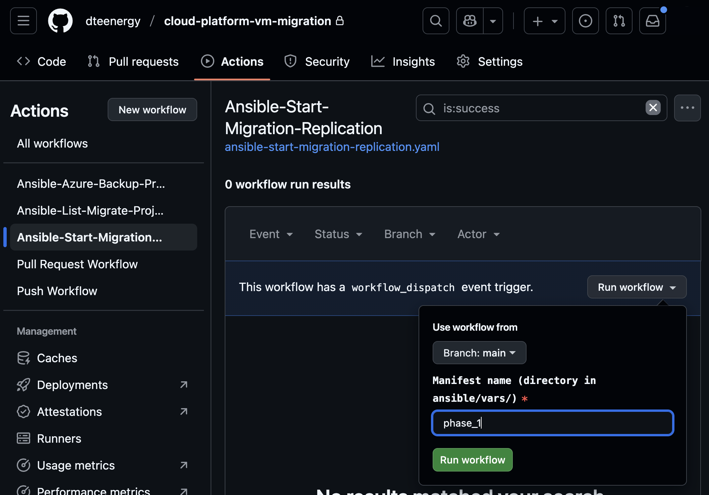

# Cloud Platform VM Migration

This repository contains Ansible playbooks and roles for automated Azure VM migration operations.

## Main Components

- **`ansible/playbooks/`**: Ready-to-use playbooks for migration operations
- **`ansible/roles/`**: Reusable roles (azure_migrate, common)
- **`ansible/vars/`**: Manifest-specific configuration
- **`.github/workflows/`**: GitHub Actions for automated execution

## Order of operations: starting a migration

1. **Run <a href="https://github.com/dteenergy/cloud-platform-vm-migration/actions/workflows/ansible-start-migration-replication.yaml" target="_blank" rel="noopener noreferrer">Ansible-Start-Migration-Replication</a>**
   Execute the workflow; provide the manifest name and any other required inputs.

2. **Wait for delta-sync**
   In <a href="https://portal.azure.com/#view/Microsoft_Azure_Migrate/AmhResourceMenuBlade/~/manageProjects" target="_blank" rel="noopener noreferrer">Azure Migrate</a> in the Azure portal, monitor the VM(s) until replication reaches **delta-sync** status.

3. **Run <a href="https://github.com/dteenergy/cloud-platform-vm-migration/actions/workflows/ansible-migration-cutover.yaml" target="_blank" rel="noopener noreferrer">Ansible-Migration-Cutover</a>**
   Execute the workflow when delta-sync is reached.

4. **Wait for cutover to complete**
   Allow the migration cutover to finish in Azure.

5. **Run <a href="https://github.com/dteenergy/cloud-platform-vm-migration/actions/workflows/ansible-generate-terraform.yaml" target="_blank" rel="noopener noreferrer">Ansible-Generate-Terraform</a>**
   Execute the workflow to generate Terraform from the manifest.

6. **Review and approve the PR**
   A pull request is opened on the target isolation zone (IZ) GitHub repo. The GitHub workflow will output the PR link as a step. Review and approve it to complete the flow.

## How to Run Playbooks

1. Navigate to the <a href="https://github.com/dteenergy/cloud-platform-vm-migration/actions" target="_blank" rel="noopener noreferrer">Actions</a> tab.
2. Select the desired workflow, and click `Run workflow`.
3. Provide any required inputs (such as manifest names) and execute.

## Contributing

To contribute to this project, you'll need to install several development tools and configure your environment. Please see our **[Contributing Guide](docs/CONTRIBUTING.md)** for:

- Required software installation (Ansible, Azure CLI, PowerShell, pre-commit)
- Development environment setup for Windows and macOS
- Pre-commit hook configuration

### 💡 Need Help?

- Check the [Contributing Guide](docs/CONTRIBUTING.md) for detailed instructions
- Review the [Ansible README](ansible/README.md) for playbook usage examples
- Contact the development team if you encounter setup difficulties

**Note:** All contributions must pass our automated checks including Ansible linting, YAML validation, and security scans before being merged.
