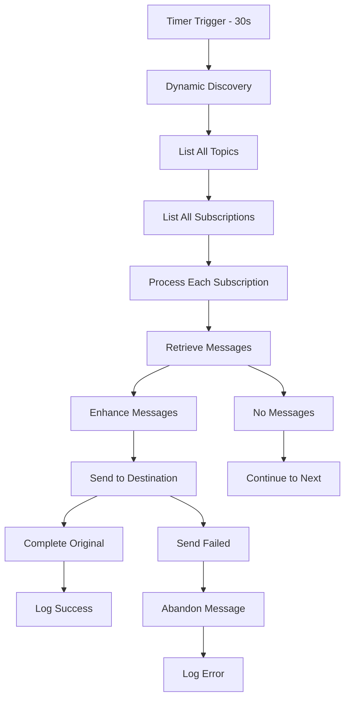

# Architecture Overview

## How It Works

1. **Timer Trigger**: The function runs every 30 seconds automatically
2. **Dynamic Discovery**: It discovers all topics and subscriptions in the source namespace
3. **Message Processing**: For each subscription, it retrieves up to 10 pending messages
4. **Message Replication**: Creates enhanced copies with tracking metadata
5. **Cross-Namespace Send**: Sends copies to the corresponding topic in the destination namespace
6. **Message Completion**: Marks original messages as complete only after successful replication
7. **Error Handling**: If sending fails, messages are abandoned for retry on the next cycle
8. **Comprehensive Logging**: All operations are logged for monitoring and troubleshooting

## Replication Flow



## Message Enhancement

Each replicated message includes additional metadata:

- `x-original-message-id`: Original message ID for tracking
- `x-replication-correlation-id`: Unique correlation ID for this replication
- `x-replication-timestamp`: When the message was replicated
- Original message properties and body are preserved

## Technical Architecture

### Azure Functions Structure
The application follows Azure Functions best practices with a structured package layout:

- **Function App**: `src/ServiceBusReplication/` contains the complete function implementation
- **Entry Point**: `__init__.py` serves as the main Azure Function entry point
- **Configuration**: `function.json` defines the timer trigger (30-second intervals)
- **Modular Design**: Separate modules for configuration, message processing, error handling, and utilities
- **Package Imports**: All internal imports use relative paths within the ServiceBusReplication package

### Component Interaction
```
Timer Trigger (30s) → __init__.py:main()
                          ↓
Configuration Loading → config.py:ReplicationConfig
                          ↓
Service Discovery → ServiceBusAdministrationClient
                          ↓
Message Processing → message_utils.py + retry_utils.py
                          ↓
Error Handling → error_handlers.py + logging_utils.py
```

## Error Handling Strategy

1. **Transient Errors**: Messages are abandoned and retried on next cycle
2. **Permanent Errors**: Logged with correlation ID for investigation
3. **Connection Issues**: Function will retry with exponential backoff
4. **Dead Letter Handling**: Optional processing of dead letter queue messages
